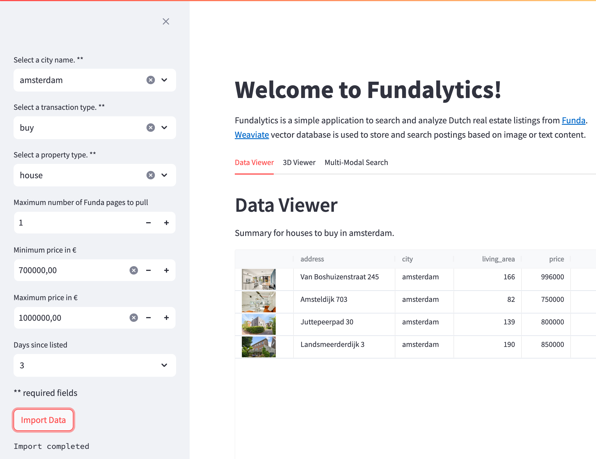
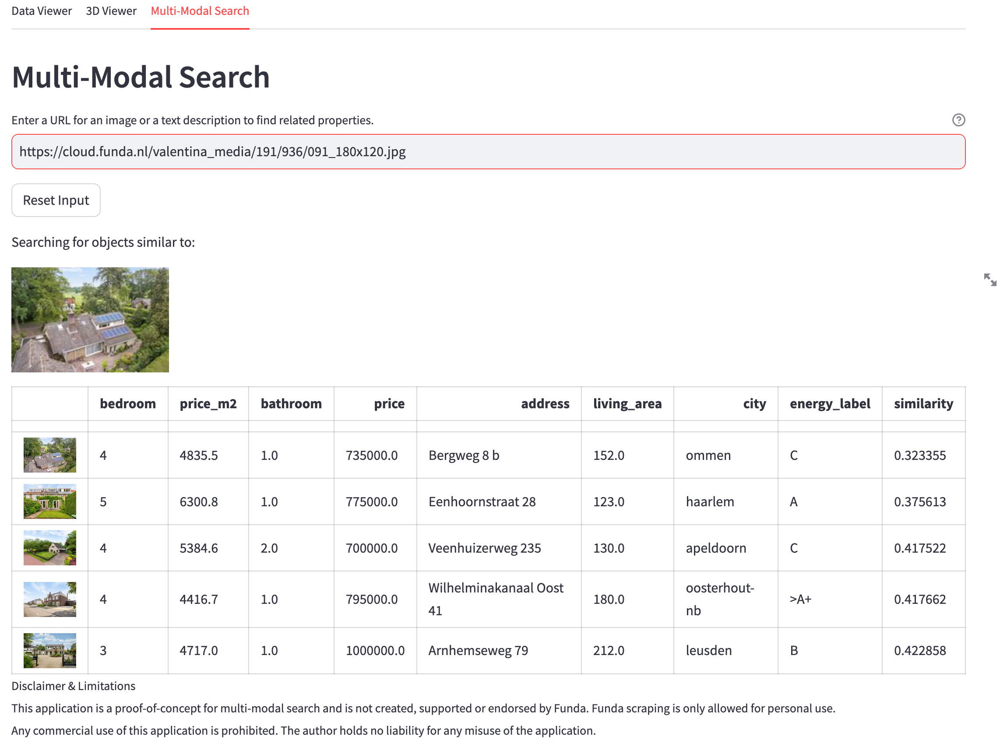
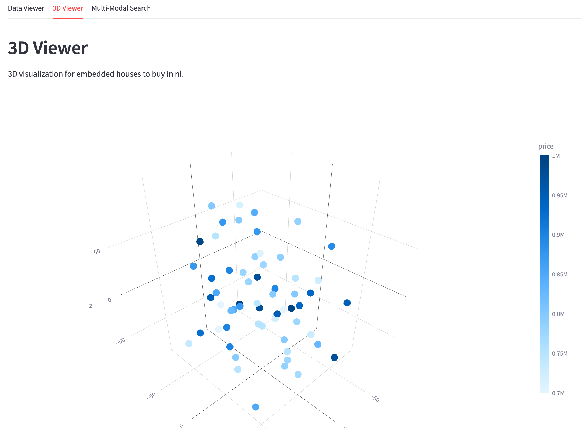

<p>
  
</p>

<br clear="center"/>
<p>
  
</p>

Fundalytics is an experimental application for analyzing real estate listing in The Netherlands.  Fundalytics scrapes postings from the [Funda](https://www.funda.nl/) real estate platform and uses [Weaviate](https://weaviate.io)
vector database to perform further analysis using multi-modal (text and image) search.

This application will almost certainly NOT help you find a house.  Rather, it is intended solely as a tool to experiment with multi-modal vector search and embedded vector databases.

<br clear="right"/>

### Disclaimer  
This application is a proof-of-concept and is not created, supported or endorsed by Funda. Funda scraping is only allowed for personal use.  Any commercial use of this application is prohibited. The author holds no liability for any misuse of the application.

## Components and workflow

The applications uses the following components
- [Streamlit](https://streamlit.io/) provides the front-end user interface and core logic.  
- [FundaScraper](https://github.com/whchien/funda-scraper) scrapes data from [Funda](https://www.funda.nl) based on user input.  
- Each real estate posting includes one or more photos (each with multiple image sizes), a description and multiple metadata fields (size, number of rooms, etc).  Data processing involves byte encoding of the main (ie. the first) image with the smallest size as well as various html formatting of links.  
- The ingested data is imported to an embedded instance of [Weaviate](https://weaviate.io/developers/weaviate/installation/embedded) vector database.  
- During import a [CLIP](https://weaviate.io/developers/weaviate/modules/retriever-vectorizer-modules/multi2vec-clip) model is used for embedding a combination of the description and the "main" image.  
  
<p>
  
</p>

Three tabs are provided to visualize the imported data.
- Listing View: A simple sortable and filterable list of the ingested data.  
  
- 3D View: tSNE is is used to reduce the 512 dimensional CLIP vector to 3 dimensions for visualization.  The 3D plot  (currently) provides very little useable information other than potentially identifying outliers.  
  
- Multi-modal search: Users can provide a link to an image or text to find "similar" properties in the listings.  

<br clear="right"/>


## Running the application
Fundalytics is bundled as a single, multi-architecture Docker image.

- Requirements: Docker or Docker Desktop
- Setup:
    - Start the container:
        ```bash
        docker run -it --rm -p 8501:8501 mpgregor/fundalytics:latest
        ```
    - Open a web browser to [http://localhost:8501](http://localhost:8501)

## Limitations
As stated, this application is a prototype to experiment with multi-modal search.  As such there are many limitations to note:
- Funda [recently updated]( https://blog.funda.nl/migrating-our-frontend-to-nuxt-3/) to a new front-end.  In the process the FundaScraper tool used was broken due to new CSS mappings. Fortunately the original pages are still available during beta testing.  Some work had to be performed to reformat page links.  If/when Funda no longer provides the pre-beta pages a new scraper will be needed. 
- Currently the data is scraped and imported each time new search criteria is provided. All previous data is deleted during ingest.  As a result:
    - The embedded Weaviate database holds only one set of data at any time.
    - This is very inefficient for detailed, multi-city searches. A more "professional" application of the vector database would include a high-quality, continuous ingest pipeline which identifies changes and updates appropriately.  The design criteria for this application were solely based on the purpose of experimenting with an embedded vector database.
    - Additionally, if paying for embeddings via an API this would increase cost for potentially re-embedding the same data.
- Descriptions provided by real estate agents are often very similar identical.  Regardless of the actual property many descriptions would probably vectorize to a relatively small space.  In addition, descriptions are occasionally provided in multiple languages.  Various research projects are investigating the impact and efficacy of multi-lingual search in multi-lingual corpora. 
- There is no particular "meaning" of data represented in the 3D view.  This was provided as an experiment.
- This workflow uses only the first / "main" image from the property posting.  Occaisionally this is nothing more than a picture of a single room or feature that the lister believes will draw attention.  As such near_image search will be limited.  Further work would be needed to identify features in all of the images and select a representative image or possibly ingest all images.
- This is "prototype" quality code.  Little time was spent in documentation, formatting, proper modularization, or object oriented programming. Only basic user testing and debugging was performed.
- No optimizations, fine tuning or detailed model selection was performed.  The multi2vec-clip model was used for simplicity. 

<p>
  
  
</p>